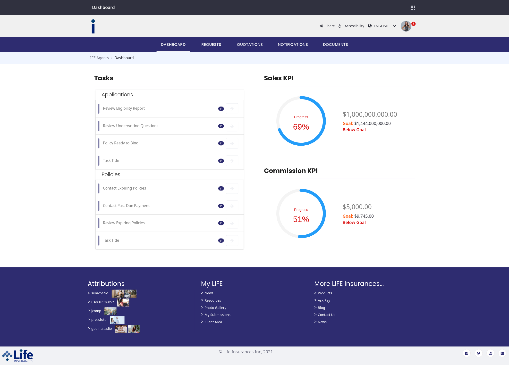
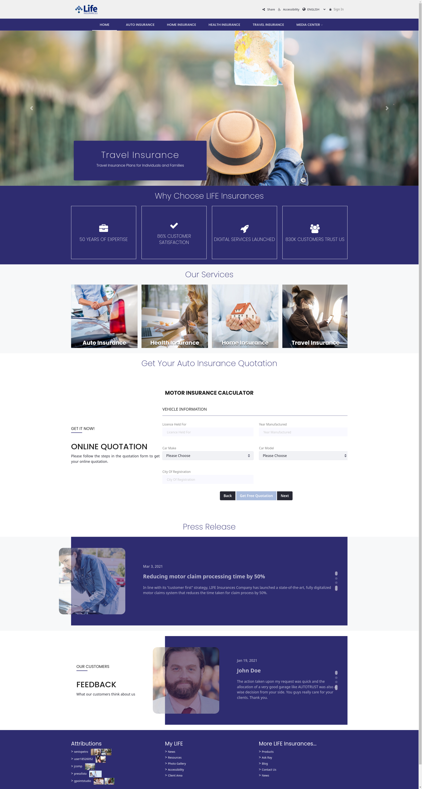
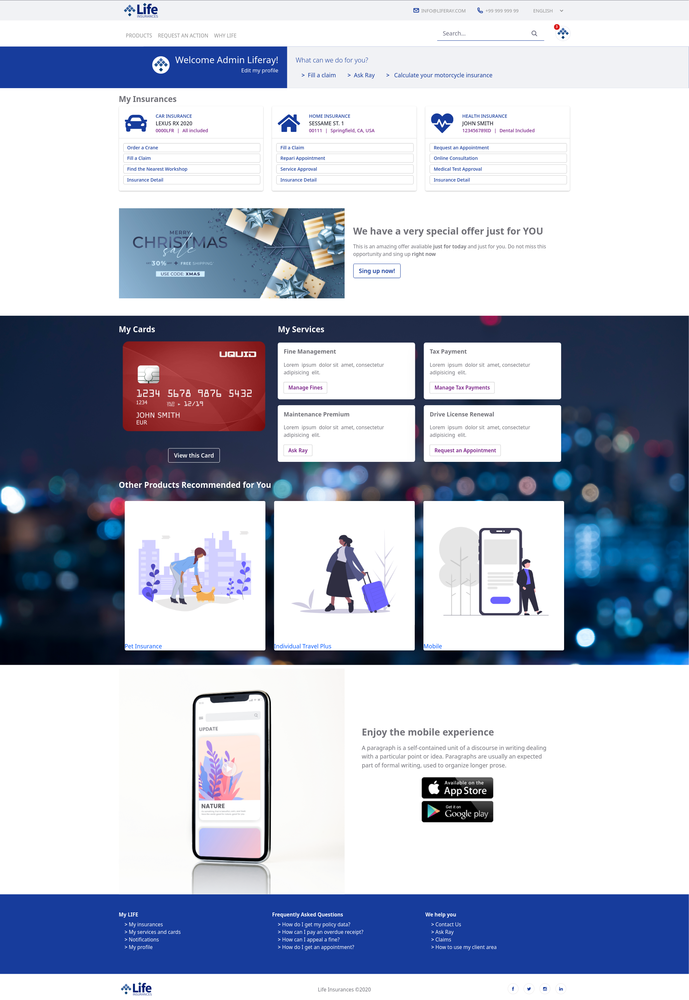

[![Contributors][contributors-shield]][contributors-url]
[![Forks][forks-shield]][forks-url]
[![Stargazers][stars-shield]][stars-url]
[![Issues][issues-shield]][issues-url]
![GitHub top language][top-lenguage-shield]
[![LinkedIn][linkedin-shield]][linkedin-url]

# lrinsurances-demo
LIFE Insurances 7.3 Demo stack

## Getting Started

### Requirements

- Docker 19+

### Run

```
docker-compose up -d
```

### Explore

Play with Liferay at http://localhost:8080 and deploy your applications under `./liferay/deploy`.

## Screenshots
### Public Site

### Agents Portals

### Customer Portal


<!-- MARKDOWN LINKS & IMAGES -->
[contributors-shield]: https://img.shields.io/github/contributors/martin-dominguez/liferay-modules.svg
[contributors-url]: https://github.com/martin-dominguez/liferay-modules/graphs/contributors
[forks-shield]: https://img.shields.io/github/forks/martin-dominguez/liferay-modules.svg
[forks-url]: https://github.com/martin-dominguez/liferay-modules/network/members
[stars-shield]: https://img.shields.io/github/stars/martin-dominguez/liferay-modules.svg
[stars-url]: https://github.com/martin-dominguez/liferay-modules/stargazers
[issues-shield]: https://img.shields.io/github/issues/martin-dominguez/liferay-modules.svg
[issues-url]: https://github.com/martin-dominguez/liferay-modules/issues
[top-lenguage-shield]: https://img.shields.io/github/languages/top/martin-dominguez/liferay-modules
[linkedin-shield]: https://img.shields.io/badge/-LinkedIn-black.svg?logo=linkedin&colorB=555
[linkedin-url]: https://linkedin.com/in/-martin-dominguez/